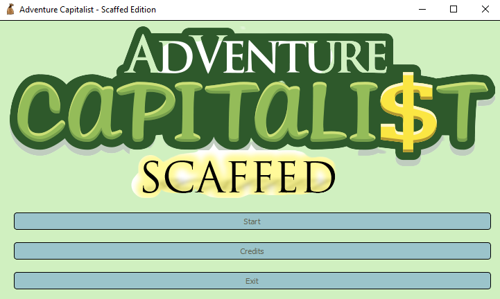
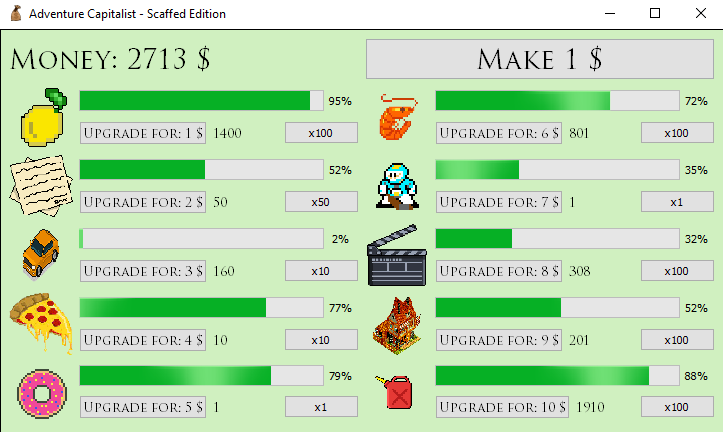
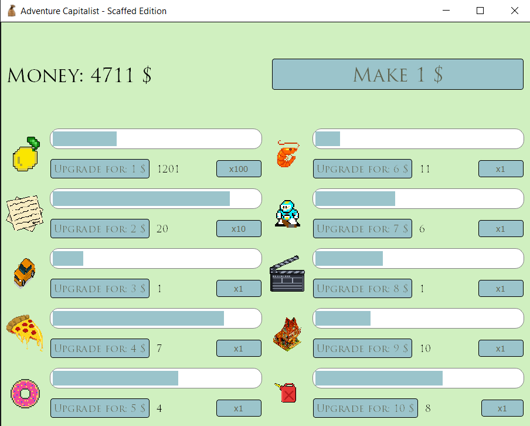

## IDLE GAME with PyQt5

## Quick sneak peek
<br>

<br>

NEW PROGRESS BARS !!! <br>
<br>

## Quick start
```commandline
git clone https://github.com/MatWich/Idle_game.git
cd Idle_game
pip install -r requirements.txt
python ./main.py
```

## TO DO

- [x] Game logic stuff
    - [x] class for incs
    - [x] timers for incs

- [x] GUI stuff
    - [x] click events
    - [x] game layout


# COLORS PALETTE
```
#5F634F
#9BC4CB
#CFEBDF
#E2FADB
#DBEFBC
```
